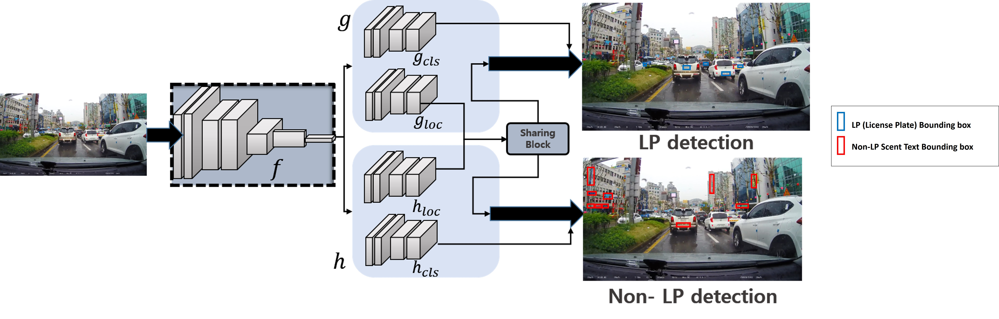
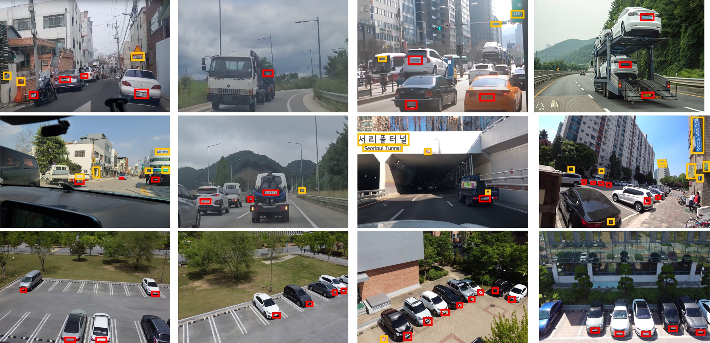
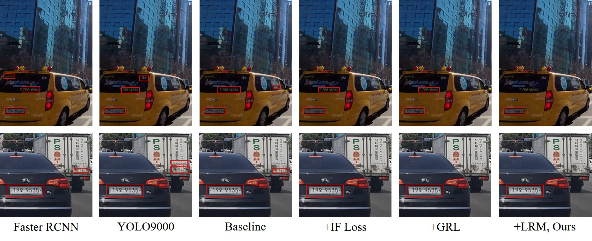

# License Plate Detection via Information Maximization (TITS-LPST)


#### Younkwan Lee, Jihyo Jeon, Yeongmin Ko, Moongu Jeon, Witold Pedrycz

This is the official website for "License Plate Detection via Information Maximization (submitted to T-ITS 2020)", which is a newly built real-world dataset for license plate detection and scene text detection.
- 9.7k+ images and 110k+ instances
- Scenes: **traffic** and **drone**, Tasks: **license plate detection** and **scene text (excluding license plate) detection**
- **Variations in tilt degrees**: Horizontal tilt degree (15 ~ 45 degrees) and vertical tilt degree (15 ~ 45 degrees).
- **Variations in distance**: The distance from the license plate to the camera location is relatively diverse.
- **Variations in blur**: Blurry image due to motion blur and hand jitter while capturing images.
- If you are interested in license plate detection, please refer to [our paper] or [our github project](https://github.com/brightyoun/TITS-LPST).



## Table of Contents
0. [Abstract](#0)
1. [Introduction](#1)  
2. [License Plate Detection Benchmarks](#2)  
   2.1 [LPST-110K Sample](#2.1)  
   2.2 [Full dataset](#2.2)   
3. [Benchmark](#3)  
   3.1 [AOLP Dataset](#3.1)  
   3.2 [PKU Dataset](#3.2)   
   3.3 [UFPR Dataset](#3.3)  
   3.4 [CCPD Dataset](#3.4)  
   3.5 [LTSP-110K Dataset](#3.5) 
4. [Comparisons](#4)  
5. [Citation](#5)  
6. [Evaluation on the test set](#6) 
7. [Contact](#7) 

## Abstract <a name="0"></a>
License plate (LP) detection in the wild remains challenging due to the diversity of environmental conditions.  Nevertheless,  prior solutions have focused on controlled environments,  such as when  LP  images frequently emerge as from an approximately frontal viewpoint and without scene text which might be mistaken for an LP. However, even for state-of-the-art object detectors, their detection performance is not satisfactory for real-world environments, suffering from various types of degradation. To solve these problems, we propose a novel end-to-end framework for robust LP detection, designed for such challenging settings. Our contribution is threefold:  (1) A novel information-theoretic learning that takes advantage of a shared encoder, an LP detector and a scene text detector (excluding LP) simultaneously; (2) Localization refinement for generalizing the bounding box regression network to complement ambiguous detection results; (3) a large-scale, comprehensive dataset, LPST-110K, representing real-world unconstrained scenes including scene text annotations. Computational tests show that the proposed model outperforms other state-of-the-art methods on a variety of challenging datasets.License plate (LP) detection in the wild remains challenging due to the diversity of environmental conditions.  Nevertheless,  prior solutions have focused on controlled environments,  such as when  LP  images frequently emerge as from an approximately frontal viewpoint and without scene text which might be mistaken for an LP. However, even for state-of-the-art object detectors, their detection performance is not satisfactory for real-world environments, suffering from various types of degradation. To solve these problems, we propose a novel end-to-end framework for robust LP detection, designed for such challenging settings. Our contribution is threefold:  (1) A novel information-theoretic learning that takes advantage of a shared encoder, an LP detector and a scene text detector (excluding LP) simultaneously; (2) Localization refinement for generalizing the bounding box regression network to complement ambiguous detection results; (3) a large-scale, comprehensive dataset, LPST-110K, representing real-world unconstrained scenes including scene text annotations. Computational tests show that the proposed model outperforms other state-of-the-art methods on a variety of challenging datasets.


## 1. Introduction <a name="1"></a>

Object detection research has attracted great interest in recent years, with models being applied widely in many traffic-related applications. A variety of methods have demonstrated high accuracy in detecting license plates (LP) under controlled settings. While existing detectors successfully applied to the LP detection problem, many key challenges still remain in \textit{unconstrained wild scenarios}. For example, real-world LP detection causes the following problems: modifications of prior settings to adapt to wild, incorrect detection results, ambiguity in classifying objects associated with scene text, low-quality visual data, uneven lighting, motion blur, and others. However, such scenarios are becoming increasingly common and gaining significant popularity in a variety of applications, including civil security, crowd analytics, law enforcement, and street view images. Despite being the most common scenario, LP benchmarks still do not consider real-world cases, and therefore many problems are not adequately addressed. As a result, state-of-the-art detectors struggle with these images. we propose an end-to-end framework which is composed of a single shared feature encoder and two parallel detection branches. The single shared encoder learns a global feature across all detection tasks (LP and non-LP respectively). More specifically, due to non-LP objects (scene text but not LP), our framework is divided into 1) LP detection network and 2) non-LP detection network. Different from traditional LP detection models, we explicitly prevent learning of non-LP objects. To this end, we bring a novel information-theoretic loss to minimize mutual information between the embedding feature and non-LP distribution that interferes with LP detection. We collect a new large-scale dataset, LPST-110K, containing images captured from unconstrained scenes. To the best of our knowledge, LPST-110K is the first dataset to address LP and scene text simultaneously for LP detection. By evaluating state-of-the-art detection models on LPST-110K, we demonstrate the accuracy improvement of our proposed model compared with other approaches.

## 2. License Plate Detection Benchmarks <a name="2"></a>

| name       | \#images               | \#instances               | \#LP instances/Image  | \#ST instances/Image     | \#Variations in tilt degrees. | \#Variations in distance. |  \#Variations in blur. |
| :--------- | :--------------------: | :-----------------------: | :-------------------: | :----------------------: | :---------------------------: | :---------------------------: | :---------------------------: |
| AOLP       |         2,049          |          2,049            |        1              |         1                | ✓ | ✗ | ✓ |
| SSIG       |         2,000          |          8,683            |        4.34           |         4.34             | ✗ | ✓ | ✗ |
| PKU        |         3,977          |          4,389            |        1.10           |         1.10             | ✗ | ✗ | ✗ |
| UFPR       |         4,500          |          4,500            |        1              |         1                | ✗ | ✓ | ✓ |
| CD-HARD    |         102            |          102              |        1              |         1                | ✓ | ✓ | ✗ |
| CCPD       |         250K           |          250K             |        1              |         1                | ✓ | ✓ | ✓ |
| **LPST-110K**  |         9,795        |          110K             |        **5.21**         |         **11**       | ✓ | ✓ | ✓ |
 
### Annotations format
The CSV file with annotations should contain one annotation per line.
Images with multiple bounding boxes should use one row per bounding box.
Note that indexing for pixel values starts at 0.
The expected format of each line is:
```
path,x1,y1,x2,y2,class_name
```

#### 2.1 LPST-110K Sample <a name="2.1"></a>
* SAMPLE 001 set:
    * images:
      [Google Drive](https://drive.google.com/file/d/1gCy0k7afMqYMuTjo4Vna2P_IfLLeRTdI/view?usp=sharing)
    * full annotations:
      [Google Drive](https://drive.google.com/file/d/1pmgP4ccrAGwRPfCDnJHG16Q72euH6nd8/view?usp=sharing)
    * license plate annotations:
      [Google Drive](https://drive.google.com/file/d/19o-4xX6Pk9y0QUK0CWuJso1vQF4Y33Nl/view?usp=sharing)
    * scene text annotations:
      [Google Drive](https://drive.google.com/file/d/19XVGtJXvRGqjij-w5kR4oVNNyWcgQ5c3/view?usp=sharing)
    * full images:
      [Google Drive](https://drive.google.com/file/d/16XAH_uDH-wmGMKVWdni2vSXU8zSTk6dL/view?usp=sharing)
      
* SAMPLE 002 set:
    * images:
      [Google Drive](https://drive.google.com/file/d/1iLFhmBT2JMK4ZKZZv8IK7wTa-Xnza5I8/view?usp=sharing)
    * full annotations:
      [Google Drive](https://drive.google.com/file/d/1yHOXeFY3WCasgtgXYQHGKL68Qw429IgY/view?usp=sharing)
    * license plate annotations:
      [Google Drive](https://drive.google.com/file/d/1JERu9Dy2YSQONV-xiR5kTD36AJA3bQ16/view?usp=sharing)
    * scene text annotations:
      [Google Drive](https://drive.google.com/file/d/1jlqKL5_4wOctYCS0X6rvm_df1ysndKCO/view?usp=sharing)
      
* SAMPLE 003 set:
    * images:
      [Google Drive](https://drive.google.com/file/d/1VFTH3uzcQMPyl9uCj5ScLVCWFAxyLyL7/view?usp=sharing)
    * full annotations:
      [Google Drive](https://drive.google.com/file/d/1XnXWa3NR5bjwO_cq5Gf2xLivpLUQ0fHI/view?usp=sharing)
    * license plate annotations:
      [Google Drive](https://drive.google.com/file/d/1qMIt3gBH5kDDER7OY1cKCtwY9A1JhBcS/view?usp=sharing)
    * scene text annotations:
      [Google Drive](https://drive.google.com/file/d/1RwKYCxylV4t7LJXBJplzzGfrAhfCENHi/view?usp=sharing)
      
 * SAMPLE 004 set:
    * images:
      [Google Drive](https://drive.google.com/file/d/1iLFhmBT2JMK4ZKZZv8IK7wTa-Xnza5I8/view?usp=sharing)
    * full annotations:
      [Google Drive](https://drive.google.com/file/d/1yHOXeFY3WCasgtgXYQHGKL68Qw429IgY/view?usp=sharing)
    * license plate annotations:
      [Google Drive](https://drive.google.com/file/d/1JERu9Dy2YSQONV-xiR5kTD36AJA3bQ16/view?usp=sharing)
    * scene text annotations:
      [Google Drive](https://drive.google.com/file/d/1jlqKL5_4wOctYCS0X6rvm_df1ysndKCO/view?usp=sharing)
      
* evaluation tools:
  [cocoapi](https://github.com/cocodataset/cocoapi)

#### 2.2 Full dataset <a name="2.2"></a>
To see full dataset, here's the Email and request Dataset [contact us](brightyoun@gist.ac.kr).
* evaluation tools:
  [cocoapi](https://github.com/cocodataset/cocoapi)


## 3. License Plate Detection Results on Benchmarks <a name="4"></a>

#### 3.1 AOLP Dataset <a name="3.1"></a>

* Results on AOLP

  |              | :AOLP         |           |              |           |              |           : |
  | method       | AC Precision | AC Recall | LE Precision | LE Recall | RP Precision | RP Recall  |
  | :----------- | :----------: | :-------: | :----------: | :-------: | :----------: | :--------: |
  | Hsu          | 91.00        |  96.00    | 91.00        |  95.00    |  91.00       | 94.00      |
  | Li           | 98.53        |  98.38    | 97.75        |  97.62    |  95.28       | 95.58      |
  | Selmi        | 92.60        |  96.80    | 93.50        |  93.30    |  92.90       | 96.20      |
  | Rafique      | -            |  98.09    | -            |  93.92    |  -           | 89.03      |
  | Xie          | 99.51        |  99.51    | 99.43        |  **99.43**    |  99.46       | 99.46      |
  | Li           | -            |  99.12    | -            |  99.08    |  -           | 98.20      |
  | Bjorklund    | **100**          |  99.30    | **99.80**        |  99.00    |  **99.80**       | **99.00**      |
  | Selmi        | 99.30        |  99.40    | 99.20        |  99.20    |  98.90       | 98.80      |
  | **Ours**     | **99.71**        |  **99.80**    | **99.80**        |  **99.32**    |  **99.71**       | **98.79**      |
  

#### 3.2 PKU Dataset <a name="3.2"></a>

* Results on validation (Accuracy)

  | method                 | G1        | G2        |  G3       | G4        | G5        | Average   |
  | :--------------------- | :-------: | :-------: | :-------: | :-------: | :-------: | :-------: |
  | RetinaNet (Baseline)   | 96.67     | 97.29     | 96.77     | 96.68     | 95.34     | 96.34     |
  | Zheng                  | 94.93     | 95.71     | 91.91     | 69.58     | 67.61     | 79.47     |
  | Zhao                   | 95.18     | 95.71     | 95.13     | 69.93     | 68.10     | 80.29     |
  | Zhou                   | 95.43     | 97.85     | 94.21     | 81.21     | 82.37     | 90.22     |
  | Li                     | 98.89     | 98.42     | 95.83     | 81.17     | 83.31     | 91.52     |
  | Yuan                   | 98.76     | 98.42     | 97.72     | 96.23     | 97.32     | 97.69     |
  | Li                     | **99.88** | **99.86** | 99.60     | **100.0** | 99.31     | 99.73     |
  | Bjorklund              | 98.77     | 99.00     | 98.92     | 97.74     | -         | 98.61     |
  | Selmi                  | 99.50     | 99.40     | 99.40     | 99.60     | 99.10     | 99.40     |
  | **Ours**               | **99.88** | **99.86** | **99.87** | 99.65     | **99.58** | **99.74** |
  

#### 3.3 UFPR Dataset <a name="3.3"></a>

* Results on validation (Recall)

  | method               | UFPR  |
  | :------------------- | :---: | 
  | RetinaNet (Baseline) | 97.22 | 
  | Laroca               | 98.33 | 
  | Laroca | 98.67 | 
  | **Ours** | **99.17** | 

#### 3.4 CCPD Dataset <a name="3.4"></a>

* Results on validation (Precision)

  | method               | UFPR  |
  | :------------------- | :---: | 
  | RetinaNet (Baseline) | 94.10 | 
  | Faster R-CNN         | 92.90 | 
  | SSD300               | 94.40 |  
  | YOLO9000             | 93.10 |  
  | Wang                 | 47.20 |  
  | Li                   | 94.20 |  
  | Xu                   | 94.50 | 
  | **Ours**             | **96.10** | 

#### 3.5 LTSP-110K Dataset <a name="3.5"></a>

* LP Detection Results on validation (AP)

  | method               | AP       | AP75     |
  | :------------------- | :------: | :------: | 
  | Faster R-CNN         | .781     | .578     | 
  | SSD300               | .740     | .639     |
  | YOLO9000             | .729     | .625     |
  | RetinaNet (Baseline) | .863     | .769     |
  | + IF loss            | .905     | .885     |
  | + GRL                | .906     | .890     |
  | + LRM (**Ours**)     | **.911** | **.915** |

* non-LP Detection Results on validation (Precision, Recall)

  | method               | Precision | Recall   |
  | :------------------- | :-------: | :------: | 
  | Faster R-CNN         | 31.1      | 33.8     | 
  | SSD300               | 29.8      | 29.2     |
  | YOLO9000             | 30.5      | 23.9     |
  | RetinaNet (Baseline) | 37.3      | 32.1     |
  | + IF loss            | **19.1**  | 21.1     |
  | + GRL                | 21.5      | 21.0     |
  | + LRM (**Ours**)     | 20.2      | **15.3** |

## 4. Qualitative Results <a name="4"></a>

#### 4.1 Ablation Study <a name="3.1"></a>

* Results on AOLP


## 5. Citation <a name="5"></a>

If this project help your research, please consider to cite our github page.

## 6. Evaluation on the test set <a name="6"></a>

Ablation studies can be conducted on the validation set.
If you would like to evaluate your model on the test set, you can send us (connor#tju.edu.cn, replace `#` with `@`) your detection results in the `json` format.

## 7. Contact <a name="7"></a>

If you have any questions or want to add your results, please feel free to [contact us](brightyoun@gist.ac.kr).
